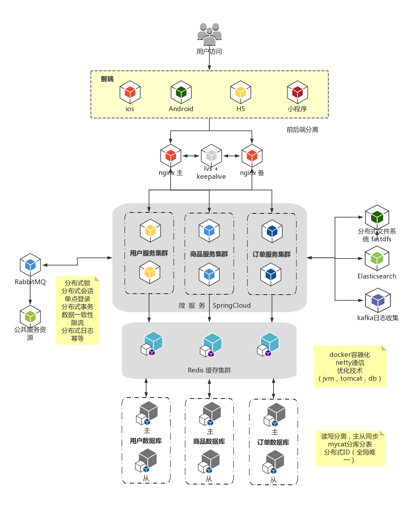

# foodie-shop
## 前言

天天吃货在线购物平台，采用现阶段流行技术实现。

## 项目介绍

foodie-shop项目是一套前后端分离电商系统，包括前台购物系统及用户中心后台系统，基于SpringBoot+MyBatis实现，采用Docker容器化部署。购物平台系统包含分类、推荐、搜索、评价、购物车、地址、订单、支付、定时任务、用户中心、订单管理模块。

后端实现springboot+mybatis 结合了elascticsearch+logstash实现与数据库中商品表的实现同步。 采用了redisson（redis客户端）或curator（zookeeper客户端）实现的分布式锁



## 组织结构

```
foodie-shop
├── db -- 数据库文件与数据库pdman原型图
├── foodie-shop-api -- 前天购物系统与用户中心Controller接口
├── foodie-shop-common -- 工具类及通用代码
├── foodie-shop-mapper -- 数据库交互层Mapper
├── foodie-shop-pojo -- entity、bo、vo实体类
├── foodie-shop-service -- Service接口与实现
├── source -- 源码等文件
├── source├── foodie-frontend -- 购物系统与用户系统前端源码
├── source├── 支付中心源码 -- 需要商户资质才可有效使用
```

## 搭建步骤

### 必备工具

| title(标题)                                                  | description(描述)                                            |
| ------------------------------------------------------------ | ------------------------------------------------------------ |
| [Java SE Development Kit 8](https://www.oracle.com/java/technologies/javase/javase-jdk8-downloads.html) | Java SE开发工具包 8                                          |
| [Maven](http://maven.apache.org/download.cgi)                | Apache Maven是一个软件项目管理和理解工具。基于项目对象模型（POM）的概念，Maven可以从中央信息管理项目的构建，报告和文档。 |
| [Git](https://git-scm.com/download/win)                      | 分布式版本控制系统                                           |
| [Tomcat](https://tomcat.apache.org/)                         | Apache Tomcat是由Apache Software Foundation（ASF）开发的一个开源Java WEB应用服务器 |
| [PDMan](http://pdman.cn/)                                    | 数据库建模工具，参见db内foodie-dev.pdman.json文件            |

### 环境变量

```wiki
一、 配置JDK环境变量
	1. 系统变量新建：
	变量名：JAVA_HOME
	变量值：D:\Program Files (x86)\Java\jdk1.8.0_301
	2. 编辑系统变量 Path
	新建：%JAVA_HOME%\bin
	3. 测试是否配置正确，打开CMD命令行窗口，依次输入：java、javac、Java -version 执行成功并版本号一致即可
二、 配置MAVEN环境变量
	1. 系统变量新建：
	变量名：M2_HOME
	变量值：D:\Program Files\apache-maven-3.8.1
	2. 编辑系统变量 Path
	新建：%M2_HOME%\bin
	3. 测试是否配置正确，打开CMD命令行窗口，输入：mvn -v 执行成功并版本号一致即可
三、 配置TOMCAT环境变量
	1. 系统变量新建：
	变量名：CATALINA_HOME
	变量值：D:\Program Files\apache-tomcat-9.0.50
	2. 编辑系统变量 Path
	新建：%CATALINA_HOME%\bin
	3. 测试是否配置正确，打开CMD命令行窗口
	启动Tomcat命令：startup
	停止Tomcat命令：shutdown.bat
```

> Windows环境部署

- 注意：只启动FoodieShopApplication，仅需安装mysql、redis即可
- 前端源码foodie-shop\foodie-shop-frontend\放入apache-tomcat-9.0.50\webapps\
- 前端访问入口：http://localhost:8080/foodie-shop-frontend/
- 后端Swagger UI：http://localhost:8088/swagger-ui/

## 技术选型

